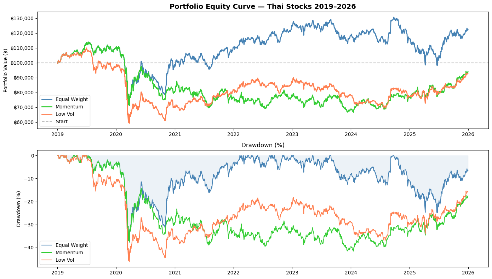

readme = """# 🇹🇭 Thai Portfolio Backtester

> A Python-based portfolio backtesting framework for Thai SET stocks,
> comparing multiple quantitative strategies with realistic transaction costs.

---

## 🚀 Overview

This project backtests **3 portfolio strategies** on 25 Thai SET stocks
from **2019 to 2026**, covering multiple market regimes including
the COVID-19 crash (2020) and the subsequent recovery.

---

## 📊 Key Results

| Strategy | CAGR | Total Return | Sharpe | Max DD |
|---|---|---|---|---|
| Equal Weight | +3.0% | +22.2% | 0.26 | -37.7% |
| Momentum | -1.1% | -6.0% | 0.03 | -46.2% |
| Low Volatility | ~0% | ~-5% | ~0.05 | -46% |

> **Winner: Equal Weight** outperforms all strategies over 6 years

---

## 💡 Key Insights

### 1. Momentum Fails in Thai Market
The Momentum strategy significantly underperformed in the SET market.
Unlike US markets, Thai stocks are heavily **Cyclical and commodity-driven**
(PTT, PTTEP, SCC). When the market reverses, Momentum portfolios
hold recently-strong stocks and suffer the most.

### 2. Diversification Wins
Equal Weight — the simplest strategy — outperformed both
sophisticated strategies. This aligns with academic research showing
that naive diversification is hard to beat in emerging markets.

### 3. COVID-19 Impact (2020)
All strategies experienced sharp drawdowns in March 2020.
Low Volatility fell the most (-46%) despite its defensive nature,
because Thai "low vol" stocks are concentrated in energy and utilities
which were severely impacted.

### 4. Transaction Costs Matter
Rebalancing quarterly at 0.25% commission + 0.1% slippage
costs approximately **฿350 per ฿100,000** per year.
High-turnover strategies like Momentum pay more in costs.

---

## 🧮 Strategies

### Strategy 1: Equal Weight
Allocates equal capital to all 25 stocks.
Rebalances quarterly. No selection — maximum diversification.

### Strategy 2: Momentum (Top 5)
Selects the **top 5 stocks by 12-month return** each quarter.
Buys recent winners, sells recent losers.

### Strategy 3: Low Volatility (Top 5)
Selects the **5 least volatile stocks** (60-day std) each quarter.
Aims for smoother returns with lower drawdowns.

---

## 📈 Sample Output



---

## 🛠 Tech Stack

- Python 3.x
- Pandas — Data manipulation
- NumPy — Numerical computing
- yFinance — Market data
- Matplotlib — Visualization

---

## ⚙️ Installation
```bash
pip install pandas numpy yfinance matplotlib
jupyter notebook thai_portfolio_backtester.ipynb
```

---

## 🔬 Methodology

- **Universe**: 25 Thai SET stocks (large-cap)
- **Period**: January 2019 – December 2025
- **Rebalance**: Quarterly (Jan, Apr, Jul, Oct)
- **Transaction Cost**: 0.25% commission + 0.1% slippage per turnover
- **Initial Capital**: ฿100,000
- **Benchmark**: Equal Weight Portfolio

---

## 🎯 Future Improvements

- [ ] Add SET Index as benchmark comparison
- [ ] Expand universe to SET100
- [ ] Add Fundamental-based strategy (from Thai Stock Screener)
- [ ] Add Monte Carlo simulation
- [ ] Build Streamlit dashboard

---

## ⚠️ Disclaimer

For **educational purposes only**.
Past performance does not guarantee future results.
Not financial advice.

---

## 👨‍💻 Author

Kittiphong Mahaheng
BBA Finance — Chiang Mai University

---

## 🔗 Related Projects

- [Thai Stock Screener](https://github.com/ymodulus21/thai-stock-screener)
  — Fundamental analysis tool for SET stocks

---

⭐ Star this repo if you find it useful!
"""

